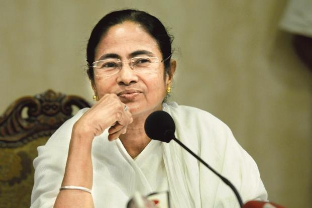

# Twitter Data Analysis 

*NaMo vs RaGa Vs Didi*

Harshitha Ravindra
---

The last 3000 tweets - from the past few years to April 14th 2019

 

---

### Common and unique words used by the top politicians in India

The following visualization is my attempt to recreate a Tableau - visualization created by  [Adam E McCann](https://public.tableau.com/en-us/s/gallery/game-thrones-words)

---

<!-- .slide: data-background-color="#000000" -->

    

        

        

    

---

### Messages and Language
<object type="image/svg+xml" data="Link_Lang.svg">
  Your browser does not support SVG
</object>

---

<!-- .slide: data-background-color="#999999" -->

# Thank You

---

# Appendix

---

    

        

        

    

---

## Other Statistics

---
<!-- http://sankeymatic.com/build/ -->